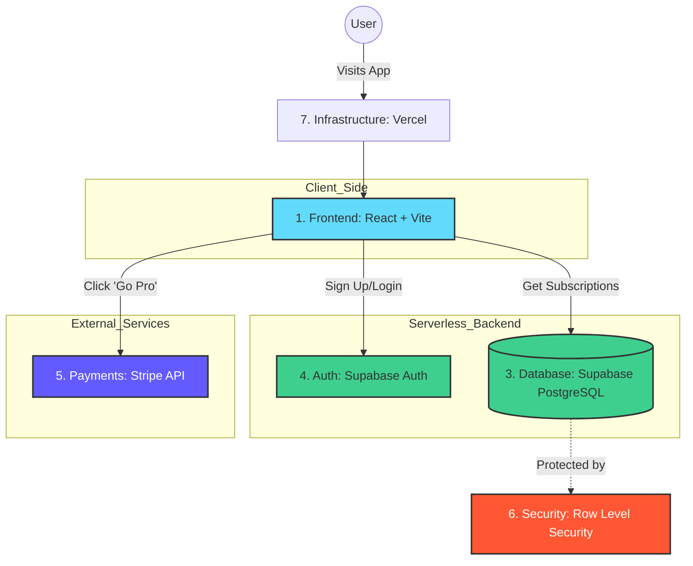

```mermaid
graph TD
    User((User)) -->|Visits App| Vercel[7. Infrastructure: Vercel]
    Vercel --> React[1. Frontend: React + Vite]

    subgraph Client_Side
        React
    end

    React -->|Sign Up/Login| Auth[4. Auth: Supabase Auth]
    React -->|Get Subscriptions| DB[(3. Database: Supabase PostgreSQL)]
    React -->|Click 'Go Pro'| Stripe[5. Payments: Stripe API]

    subgraph Serverless_Backend
        Auth
        DB
    end

    subgraph External_Services
        Stripe
    end

    %% 6. Security Layer (RLS)
    DB -.->|Protected by| RLS[6. Security: Row Level Security]

    style React fill:#61DAFB,stroke:#333,stroke-width:2px
    style DB fill:#3ECF8E,stroke:#333,stroke-width:2px
    style Auth fill:#3ECF8E,stroke:#333,stroke-width:2px
    style Stripe fill:#635BFF,stroke:#333,stroke-width:2px,color:#fff
    style RLS fill:#FF5733,stroke:#333,stroke-width:2px,color:#fff
```
